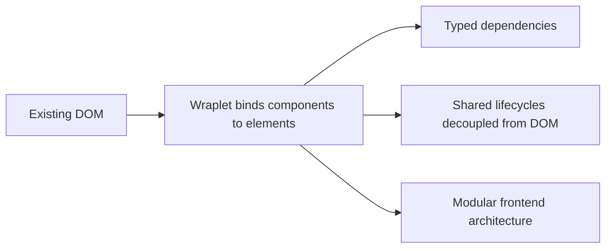

import BrowserOnly from "@docusaurus/BrowserOnly";

**wraplet** is a JavaScript and TypeScript framework for organizing frontend code around the real DOM. Instead of replacing the browser's native structure with a virtual rendering layer,
it helps you turn actual interface elements into components with their own lifecycle, dependencies, and responsibilities.

It is especially useful when you want to improve architecture without rebuilding the entire UI from scratch.

## Core idea

The framework connects class instances to real DOM nodes and lets you manage them in a predictable way.

## A wraplet in 3 minutes

A wraplet is just a class that attaches to an element you already have, gives it a
lifecycle, and lets you wire in typed dependencies. Here is the smallest possible example:

<BrowserOnly>
    {() => {
        const Example = require("@site/src/components/Example").default;
        const MonacoEditor = require("@site/src/components/MonacoEditor").default;
        return (
            <Example style="small">
                <h4>HTML</h4>
                <MonacoEditor contentUrl="/examples/basics/html.htm" language="html" height="40px" />
                <h4>TypeScript</h4>
                <MonacoEditor contentUrl="/examples/basics/typescript.txt" language="typescript" stripComments={true} />
            </Example>
        );
    }}
</BrowserOnly>

That is the whole mental model: a class, an element, a lifecycle. No virtual DOM, no template language, no compiler step.

Does it look like a Web Component to you? That's a great observation! The similarities are striking indeed, but there
is more to Wraplet than meets the eye in this small example. To see the direct comparison, see the [Wraplet vs Web Components](/blog/wraplet-vs-web-components) blog post.

If you're looking for a more general rationale of why Wraplet may be worth your time, you may take a look at [Front-end, regrounded: Why Wraplet might be what you’re missing](/blog/why-wraplet) blog post.

## What Wraplet is for

Wraplet is a strong fit for projects that:

- work directly with an existing DOM,
- need a clear object-oriented model,
- want typed, declarative dependencies between components,
- evolve gradually instead of moving to a full SPA rewrite.

## Where Wraplet shines

Wraplet is a strong fit for projects that work directly with an existing DOM, prefer
classes, encapsulation, and explicit relationships, and want to evolve gradually
instead of moving to a full SPA rewrite. In practice, that means:

- a clear object-oriented model that stays close to the DOM, instead of hiding it behind a heavy abstraction,
- typed, declarative dependencies between components, with safe refactoring through a typed API,
- a predictable lifecycle for initialization and cleanup,
- a natural path for progressive modernization of existing interfaces.

## Pick your path

Depending on what you're after, here's where to go next:

- 📖 **See what it's great at in detail** → [Core strengths](/docs/getting-started/what-is-wraplet/core-strengths)
- 🔧 **Prefer the technical angle** → [TypeScript-first Architecture](/docs/getting-started/typescript-first-architecture), then [Core concepts](/docs/category/core-concepts)
- 🚀 **Had enough theory, just want to build** → [Quick start](/docs/getting-started/quick-start)
