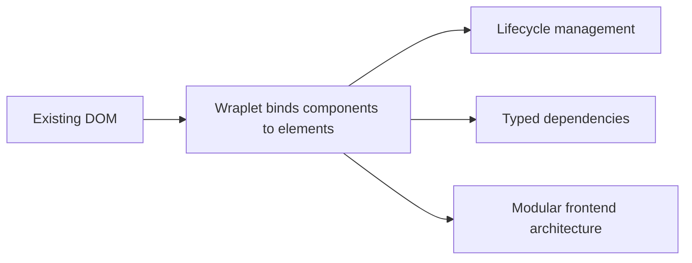

**wraplet** is a JavaScript and TypeScript framework for organizing frontend code around the real DOM. Instead of replacing the browser's native structure with a virtual rendering layer,
it helps you turn actual interface elements into components with their own lifecycle, dependencies, and responsibilities.

It is especially useful when you want to improve architecture without rebuilding the entire UI from scratch.

Wraplet embraces the old-school philosophy of a front-end developer working with both the backend-rendered templates and front-end JavaScript,
but with new technology, making it as clean as never before, with declarative dependency management and easily testable subcomponents.

## What Wraplet is for

Wraplet is a strong fit for projects that:

- work directly with an existing DOM,
- need a clear object-oriented model,
- want typed, declarative dependencies between components,
- evolve gradually instead of moving to a full SPA rewrite.

## Core idea

The framework connects class instances to real DOM nodes and lets you manage them in a predictable way.

## Why to consider Wraplet

- It keeps code close to the DOM instead of hiding it behind a heavy abstraction.
- It provides a predictable lifecycle for initialization and cleanup.
- It supports safe refactoring with a typed API.
- It works well for progressive modernization of existing interfaces.
- It fits teams that prefer classes, encapsulation, and explicit relationships.

## In this documentation

This documentation provides an overview of:

- what Wraplet is,
- what are its core strengths,
- where it works best,
- how it compares with popular frontend frameworks.

and a lot of code examples!

Continue with [Core strengths](./core-strengths) to see what it excels at.

Or, if you look for technicalities, jump straight into the [Technical overview](/docs/getting-started/technical-overview)
and continue through the [Core concepts](/docs/core-concepts).