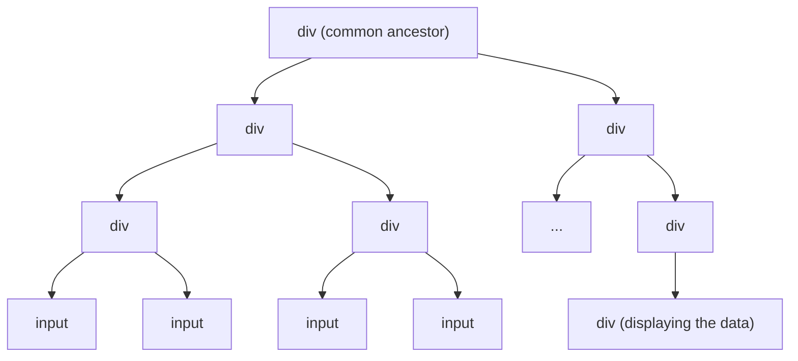

## What is DependencyManager?

`DependencyManager` is an object that abstracts away management of dependencies.

## Problem

Normally the HTML structure looks something like this:

It's a tree-like structure with many unrelated nodes that often are used only for styling. In the above example we are interested in
input fields and the div for displaying our custom data. Traditionally, using a library like jQuery, you would have to find
related nodes and wire them together manually. This can cause problems that are the reason why jQuery is currently frowned upon.

- Such manually wired-up logic is a single unit that can easily become an unreadable black box.
- It's difficult to test.
- It's easy to add listeners to nodes, but it's also easy to forget to remove them when they are no longer needed. By default, there is no lifecycle management.

## Solution

DependencyManager solves these problems. It turns a tree of nodes into a tree of dependencies. The above example becomes:

Each node that is a dependency of the `MyWraplet` is wrapped with its own wraplet instance. These subwraplets provide interfaces
to interact with the wrapped node. The consequences are that:
- Each node we depend on is its own unit that is:
    - Easy to understand (we immediately see what properties it exposes for the rest of the app)
    - Easy to test individually.
    - Has a lifecycle that is tied to the parent wraplet's lifecycle: listeners are removed automatically when the parent wraplet is destroyed.
- The dependency tree is described by a declarative dependency map, so the whole structure is easy to understand.
- Dependencies `MyWraplet` interacts with are guarded and typehinted by the **TypeScript**.

## How does it work?

Based on the dependency map, it:
1. Finds correct nodes among descendants of the provided ParentNode,
2. Wraps them with wraplet instances based on chosen classes (providing them with their own DependencyManagers if we need a multi-level dependency tree),
3. Makes them directly accessible as dependencies.

Additionally, it can `initialize` or `destroy` all dependencies at once, making it easy to manage the lifecycle of the whole tree.

## Dependency Map

Dependency map is a plain object that describes the dependencies. It's consumed by the DependencyManager.
Based on a dependency map, DependencyManager instantiates dependencies and allows for managing their lifecycles collectively.

You can find technical reference [HERE](/docs/reference/dependency-manager/dependency-map).

## DDM

`DDM` is the default DependencyManager's implementation provided by the Wraplet library.

## Lifecycle

`DependencyManager` manages the lifecycle of dependencies. It can:
1. instantiate them (synchronously),
2. initialize them (asynchronously),
3. destroy them (asynchronously).

In the `DDM` implementation asynchronous lifecycle operations happen for all dependencies in parallel.
It means that if one of the dependencies throws an error during e.g., initialization, it won't stop other initializations.

## Does a wraplet actually need a DependencyManager?

No! Having an instance of the DependencyManager injected is not what defines a wraplet.
What defines a wraplet is the [Wraplet API](/docs/concepts/wraplet), accessible through the `wraplet` property.

`AbstractDependentWraplet` automatically wires up the injected DependencyManager to the `Wraplet API`, making
dependencies' lifecycle tied to the parent wraplet's lifecycle. However, if your wraplet doesn't need dependency management,
you may implement it by extending the `AbstractWraplet` class instead. This class is even thinner, as it doesn't handle dependencies.

## Reference

- [DependencyManager](/docs/reference/dependency-manager).