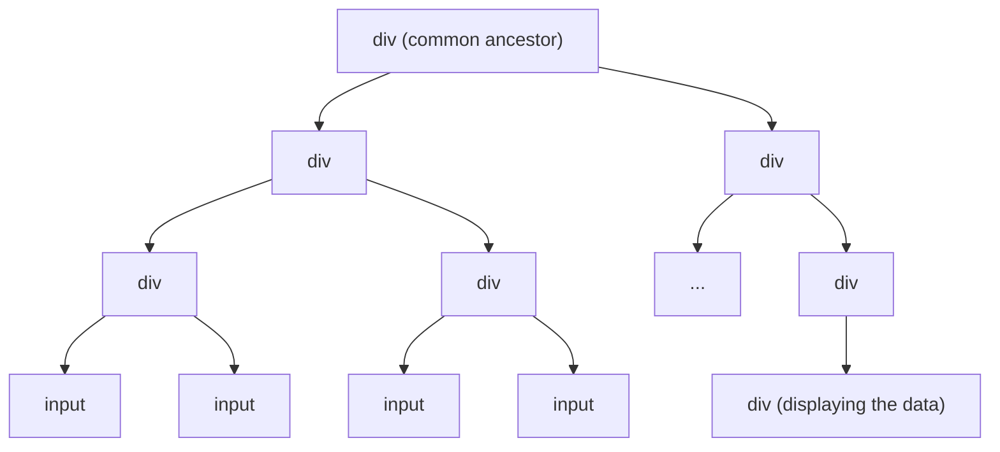
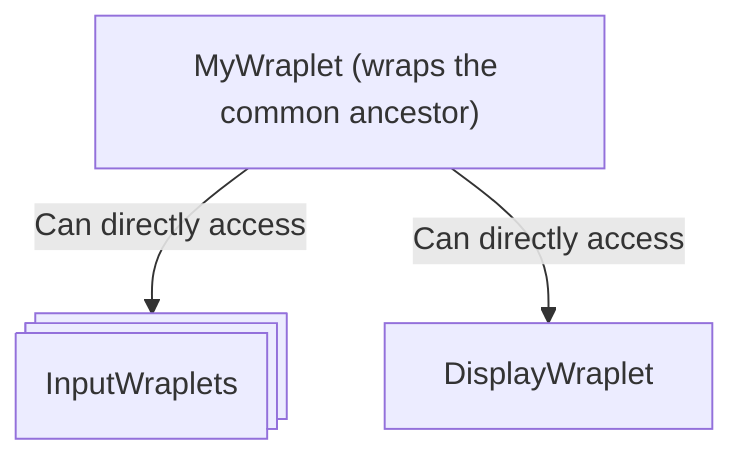
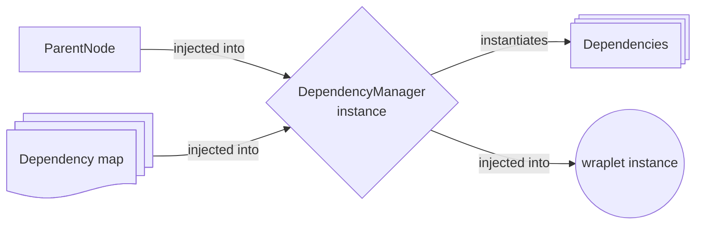

## What is DependencyManager?

`DependencyManager` is the object responsible for **finding child nodes in the DOM, wrapping them in wraplets, and
managing their lifecycle as a group**.

It is the runtime piece that turns a static [dependency map](/docs/reference/dependency-manager/dependency-map)
into a working tree of wraplet instances – and it is the mechanism that powers
[`AbstractDependentWraplet`](/docs/concepts/abstract-wraplet#abstractdependentwraplet) under the hood.

You usually don't construct a `DependencyManager` by hand. The abstract base classes do it for you. But the concept
is important to understand, because it explains **how parent wraplets get their children, and why those children
behave the way they do**.

## The problem it solves

A typical interface, viewed as raw HTML, is mostly noise:

A lot of this structure exists purely for layout or styling. From the application's point of view, only a few
nodes are *interesting* – here, the input fields and the div displaying the result.

Without a framework, you typically wire those nodes together by hand: query selectors here, event listeners there,
references stored in local variables. This style of code – familiar from jQuery codebases – tends to suffer from
the same recurring problems:

- **It becomes a black box.** Logic, selectors, listeners and state all live in one place. The "structure" of the
  feature is implicit.
- **It's hard to test.** You can't easily isolate "the input behavior" or "the display behavior" from the rest.
- **Cleanup is fragile.** Adding listeners is easy. Remembering to remove them when the feature is removed is not.
  There's no built-in lifecycle.
- **Refactoring is risky.** Renaming a class or moving an element can silently break the wiring.

## What DependencyManager does about it

`DependencyManager` reframes the same DOM as a **typed dependency tree**:

Each "interesting" node becomes its own wraplet, with its own public API. The parent wraplet talks to its
children through that API instead of reaching into raw DOM.

The benefits compound:

- **Each child is a unit.** It's easy to understand (you see exactly which methods it exposes), easy to test
  in isolation, and its lifecycle is tied to the parent's, so listeners are cleaned up automatically when
  the parent is destroyed.
- **The structure is declarative.** The whole shape of the component is described by a [dependency map](/docs/reference/dependency-manager/dependency-map),
  which is plain data and reads like a schema.
- **Everything is typed.** TypeScript knows whether a dependency is single or multiple, required or optional,
  and what wraplet class it points to. Renaming a key in the map updates the type wherever the parent uses it.
- **Refactoring is guided by the compiler.** Changing the shape of a component (adding/removing a child,
  switching from single to multiple, making something optional) propagates through the type system.

## How it works

At a high level, a `DependencyManager` instance receives two things and produces a third:

Given a `ParentNode` and a dependency map, the manager:

1. **Finds the right descendant nodes** – using the selectors (or selector callbacks) declared in the map.
2. **Wraps them into wraplets** – using the classes declared in the map. If a child is itself a dependent
   wraplet, it gets its own `DependencyManager`, recursively – which is how multi-level dependency trees emerge.
3. **Exposes them as typed dependencies** – accessible by key, with types derived from the map (single vs.
   multiple, required vs. optional).
4. **Manages their lifecycle as a group** – instantiation, initialization, and destruction can all be triggered
   collectively.

## Lifecycle management

`DependencyManager` performs lifecycle operations on dependencies in three distinct phases:

1. **Instantiation** (synchronous) – constructors are called, the dependency tree comes into existence.
2. **Initialization** (asynchronous) – each dependency's `initialize` runs through its `WrapletApi`.
3. **Destruction** (asynchronous) – each dependency's `destroy` runs through its `WrapletApi`.

This is the same three-phase model used by individual wraplets – see [Lifecycle](/docs/concepts/lifecycle) for the
overall picture.

In the default implementation (`DDM`, see below), asynchronous phases run **in parallel** for all dependencies.
That means a failure during, say, initialization of one dependency does **not** abort initialization of the others.
Each dependency manages its own success or failure independently.

In addition to the bulk operations, you can subscribe to lifecycle events of individual dependencies via:

- `addDependencyInstantiatedListener`
- `addDependencyInitializedListener`
- `addDependencyDestroyedListener`

These hooks let a parent react to a specific child becoming ready (or being torn down) without waiting for the
rest of the tree.

## Working with existing instances

Sometimes a dependency isn't something the `DependencyManager` should construct on its own – maybe it already
exists somewhere else, or it's shared between several parents. For these cases the manager exposes:

- **`setExistingInstance`** – inject an already-built wraplet as a single (`multiple: false`) dependency.
- **`addExistingInstance`** – add an already-built wraplet to a multiple (`multiple: true`) dependency.

Both must be called **before** initialization. From that point on, the injected instance behaves like any other
dependency: it shows up under `dependencies`, it's typed, and it participates in the lifecycle.

This is the recommended escape hatch when you need to break out of pure auto-wiring – for example, when
integrating with code outside the Wraplet ecosystem.

## Dynamic DOM and `syncDependencies`

If your DOM changes at runtime (nodes appearing or disappearing under the wrapped node), `DependencyManager`
provides an **experimental** `syncDependencies` operation that reconciles the dependency tree with the current
state of the DOM:

- new matching nodes get new dependency instances,
- dependencies whose nodes are no longer in the tree get destroyed (unless they were marked as non-destructible
  or they have no selector).

For a fuller discussion of dynamically changing DOM, see [Dynamic DOM](/docs/dynamic-dom).

## DDM – the default implementation

`DDM` is the default implementation of the `DependencyManager` interface, shipped with the Wraplet library.

In day-to-day code, you rarely instantiate `DDM` directly – `AbstractDependentWraplet` and its static factories
take care of that. You'll typically encounter `DDM` only when you want to build a dependent wraplet completely
manually, or when writing tests where you need direct control over the manager.

Because `DependencyManager` is an interface, you can also provide your own implementation if you ever need
behavior different from `DDM`'s defaults (for example, a sequential lifecycle instead of a parallel one).

## Does a wraplet actually need a DependencyManager?

**No.** A `DependencyManager` is *not* part of the definition of a wraplet.

What defines a wraplet is the [Wraplet API](/docs/concepts/wraplet) – the contract exposed through the `wraplet`
property. Many wraplets are leaves: they wrap a single node, do their own thing, and don't need any children.
For those, [`AbstractWraplet`](/docs/concepts/abstract-wraplet) is enough, and no `DependencyManager` is involved.

`DependencyManager` enters the picture only when a wraplet has internal structure made of other wraplets. In that
case, [`AbstractDependentWraplet`](/docs/concepts/abstract-wraplet#abstractdependentwraplet) wires it up
automatically: the manager's lifecycle becomes part of the parent's lifecycle, so children initialize and destroy
together with their parent.

## Reference

- [DependencyManager](/docs/reference/dependency-manager)
- [DependencyMap (with examples)](/docs/reference/dependency-manager/dependency-map)