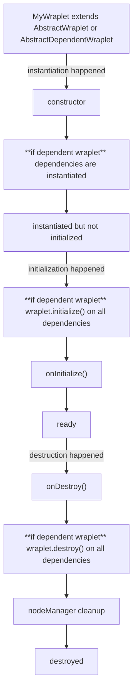

Lifecycle is a central idea in Wraplet. A wraplet is not just a wrapper around a DOM node – it's an object
with a **defined moment when it comes into existence, a moment when it becomes ready to do work, and a moment
when it tears itself down**.

Designing your components around these three moments is what gives Wraplet code its predictable structure and
its automatic cleanup guarantees.

## The three phases

Every wraplet goes through the same three phases:

1. **Instantiation** *(synchronous)* – the constructor runs. The object exists, dependencies are wired up,
   but no work has started yet.
2. **Initialization** *(asynchronous)* – the wraplet attaches listeners, registers itself with external
   services, starts timers, and so on. After this phase, the wraplet is ready to use.
3. **Destruction** *(asynchronous)* – the wraplet releases everything it owns: listeners, timers, child
   wraplets, external resources. After this phase, the wraplet is gone.

These phases are exposed through the [`WrapletApi`](/docs/concepts/wraplet) (`initialize`, `destroy`, `status`),
which is the contract every wraplet implements.

## Why three phases and not one?

Splitting "create" from "initialize" might look redundant, but it matters in practice:

- **Construction is cheap and synchronous.** You can build a tree of wraplets, inspect it, run tests against
  it, and never trigger any side effects on the DOM or any external system.
- **Initialization is where side effects live.** Listeners get attached, timers start, third-party widgets boot up.
  This is naturally asynchronous – a child wraplet might need to load something before it's ready.
- **Destruction mirrors initialization.** Whatever was attached during init can be deterministically removed,
  in a single, well-defined moment.

The practical consequence is that **construction-time bugs and runtime bugs become two different things**.
A misconfigured dependency map fails immediately, before any listeners exist. A failed initialization doesn't
leave half-attached listeners behind.

## The flow

This is the actual flow when you use [`AbstractWraplet`](/docs/concepts/abstract-wraplet) or
[`AbstractDependentWraplet`](/docs/concepts/abstract-wraplet#abstractdependentwraplet):

A few things worth noting from the diagram:
- **Children are built before the parent's `onInitialize`.** By the time your `onInitialize` runs, all
  declared dependencies already exist. You can safely access `this.d` from the start.
- **Children are initialized before the parent's `onInitialize`.** Once your code starts, every child is
  guaranteed to be initialized too.
- **Destruction is top-down – with listener cleanup at the very end.** Your `onDestroy` runs first, then
  children get destroyed, then the [`NodeManager`](/docs/concepts/node-manager) removes any listeners you
  registered through it. This ordering means you can still talk to children inside `onDestroy` if you need to.
- **Initialization and destruction are intentionally asymmetric.** Initialization is bottom-up (children
  ready before the parent starts working), destruction is top-down (parent gets a chance to react before
  children disappear). In both phases, your code runs in a window where children are fully available.

## Hooks you implement
When you extend an abstract base class, you don't trigger lifecycle phases yourself – the framework does that for you. What you do implement is the **hooks**:
- **`onInitialize()`** – your "this is where work begins" method. Add listeners through , set up state, talk to children. It's `async`, so you can `await` anything you need. `this.nodeManager`
- **`onDestroy()`** – your "this is where I tear down what I personally set up" method. You don't need to remove listeners that were registered via `nodeManager`, and you don't need to destroy your declared dependencies – the framework handles both.

In other words: implement these hooks for the things that are _uniquely yours_. The framework handles the parts that are mechanical.

## Hooks you trigger
From the outside (or from a parent that doesn't use `AbstractDependentWraplet`), you trigger lifecycle phases through the `WrapletApi`:
- **`wraplet.initialize()`** – moves the wraplet from "instantiated" to "ready".
- **`wraplet.destroy()`** – moves the wraplet from "ready" (or "instantiated") to "destroyed".
- **`wraplet.status`** – tells you which phase the wraplet is currently in (, `isGettingInitialized`, `isDestroyed`, `isGettingDestroyed`). `isInitialized`
- **`wraplet.addDestroyListener(callback)`** – lets external code react when this wraplet is destroyed, without coupling the wraplet itself to that code.

If you use `AbstractDependentWraplet`, you don't call `initialize`/`destroy` on every child manually. The parent's lifecycle drives the children's lifecycle through the [`DependencyManager`](/docs/concepts/dependency-manager).

## Lifecycle of dependencies
When a wraplet has children (via `AbstractDependentWraplet` and a [dependency map](/docs/reference/dependency-manager/dependency-map)), their lifecycle is bound to the parent's lifecycle:
- During **construction**, dependencies are instantiated synchronously alongside the parent.
- During **initialization**, the parent first orders the `DependencyManager` to initialize all children (asynchronously, in parallel in the default `DDM` implementation), and only then runs its own `onInitialize`.
- During **destruction**, the parent runs its own `onDestroy` first, then orders the `DependencyManager` to destroy all children, then `NodeManager` cleans up the listeners.

You can also subscribe to **per-dependency** lifecycle events – for example, "act as soon as this specific child is initialized, without waiting for the rest". See the dedicated section on [lifecycle in DependencyManager](/docs/concepts/dependency-manager#lifecycle-management).

## Lifecycle of listeners
Event listeners registered through `this.nodeManager.addListener(...)` are bound to the wraplet's lifecycle:
- they are attached when you call `addListener` (typically inside `onInitialize`),
- they are removed automatically as the very last step of destruction.

That's why this documentation strongly recommends over a raw `this.node.addEventListener(...)`: it makes the listeners part of the lifecycle. See [NodeManager](/docs/concepts/node-manager) for details. `nodeManager.addListener`

## Status: where in the lifecycle am I?
Every wraplet exposes a read-only `status` object on its `WrapletApi`. It tells you which phase the wraplet is currently in:
- `isGettingInitialized` – initialization started but hasn't finished yet,
- `isInitialized` – initialization completed,
- `isGettingDestroyed` – destruction started but hasn't finished yet,
- `isDestroyed` – destruction completed.

This is useful when external code wants to coordinate with a wraplet whose lifecycle isn't fully under its control – for example, when reacting to an event that may arrive _before_ the wraplet is initialized, or _after_ it has already been destroyed.

## Idempotency and safety
Lifecycle methods are designed to behave safely in real-world conditions:
- Calling `wraplet.initialize()` on an already-initialized wraplet is safe – it won't run `onInitialize` twice.
- Calling `wraplet.destroy()` on an already-destroyed wraplet is safe – it won't run `onDestroy` twice.
- `wraplet.initialize()` and `wraplet.destroy()` methods are **memoized**. It means that you don't need to check
  if they are already getting initialized or destroyed. If you call them during an already running initialization
  or destruction process, you will get the promise that is currently being resolved.
- Errors thrown inside `onInitialize` or `onDestroy` of a single dependency don't prevent the rest of its siblings from going through the same phase (in the default `DDM` implementation).

That doesn't mean you should ignore errors – you should still handle and log them – but it does mean that one broken child won't cascade into a stuck or partially-destroyed component tree.

## A practical mental model
When designing a wraplet, walk through the three phases explicitly:
1. **What does construction need?** Just the node (or the `DependencyManager`). No I/O.
2. **What does initialization need to do?** Attach listeners (through `NodeManager`), connect to external services, prepare initial state.
3. **What does destruction need to clean up?** Anything that was set up _outside_ the framework's automatic cleanup – for example, third-party widgets, intervals, observers, subscriptions.

If you find yourself attaching listeners directly without `NodeManager`, starting timers without storing them, or talking to external services without a corresponding cleanup, the design is signaling that destruction has not been thought through yet.
The reward for taking lifecycle seriously is concrete: components that are safe to attach, detach, and re-attach in any order – which is exactly what dynamic, server-rendered, multi-page interfaces need.

## Related
- [Wraplet](/docs/concepts/wraplet) – the contract that exposes the lifecycle.
- [AbstractWraplet / AbstractDependentWraplet](/docs/concepts/abstract-wraplet) – the base classes that implement the lifecycle for you.
- [DependencyManager](/docs/concepts/dependency-manager) – how children's lifecycle is tied to the parent's.
- [NodeManager](/docs/concepts/node-manager) – how listeners are tied to the lifecycle.
- [Dynamic DOM](/docs/dynamic-dom) – using lifecycle to handle DOM that changes at runtime.