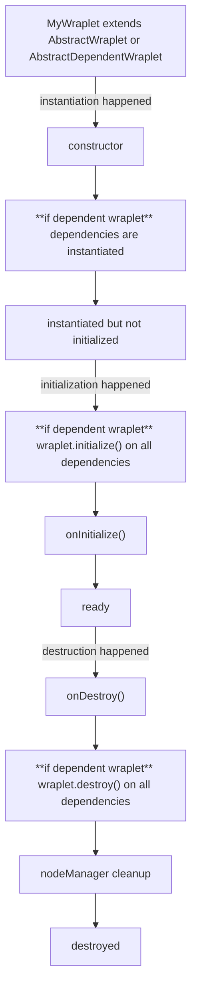

A big part of wraplet is lifecycle management. Each wraplet can be:
1. instantiated (synchronously),
2. initialized (asynchronously),
3. destroyed (asynchronously).

This is a diagram of the actual flow:

